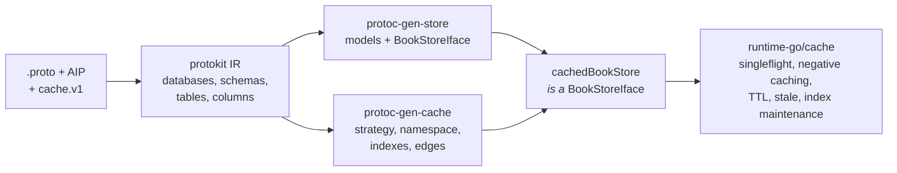
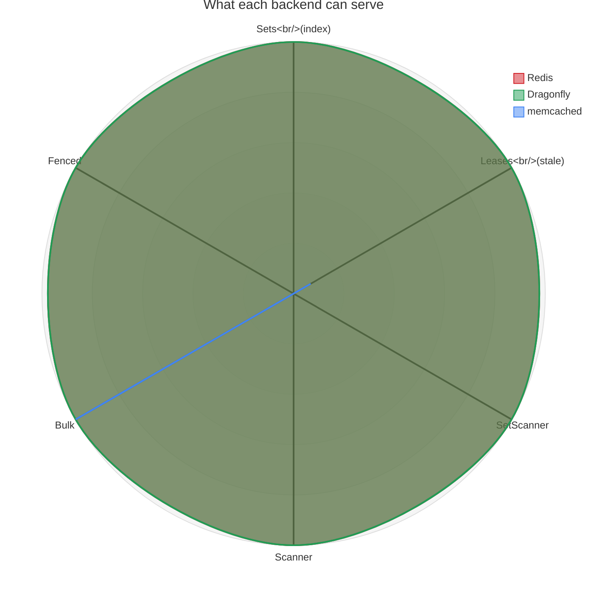
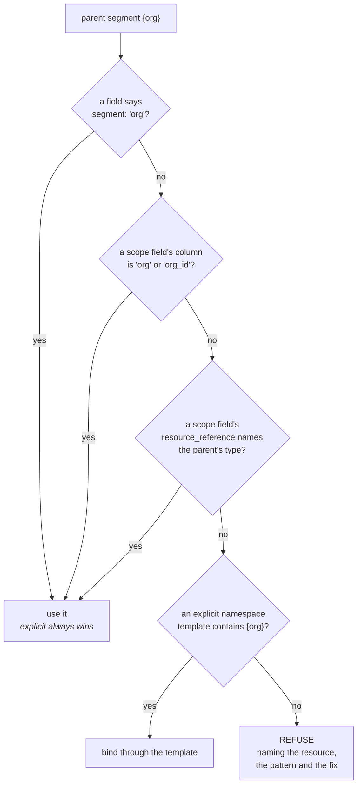
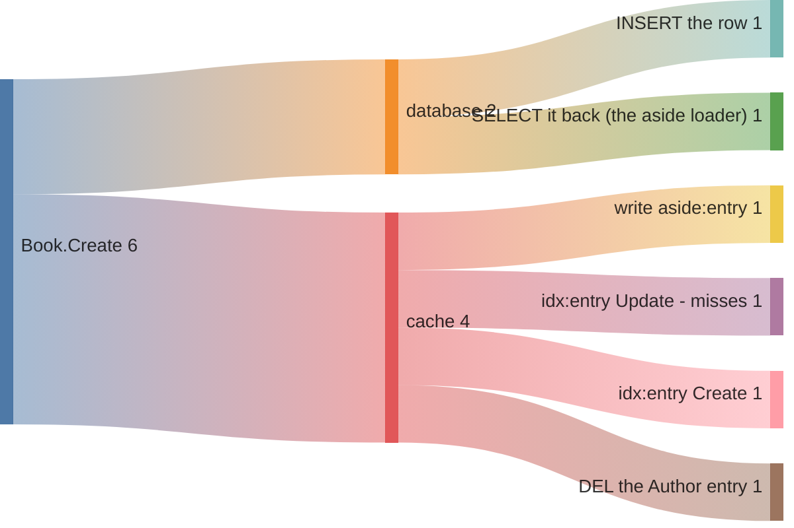
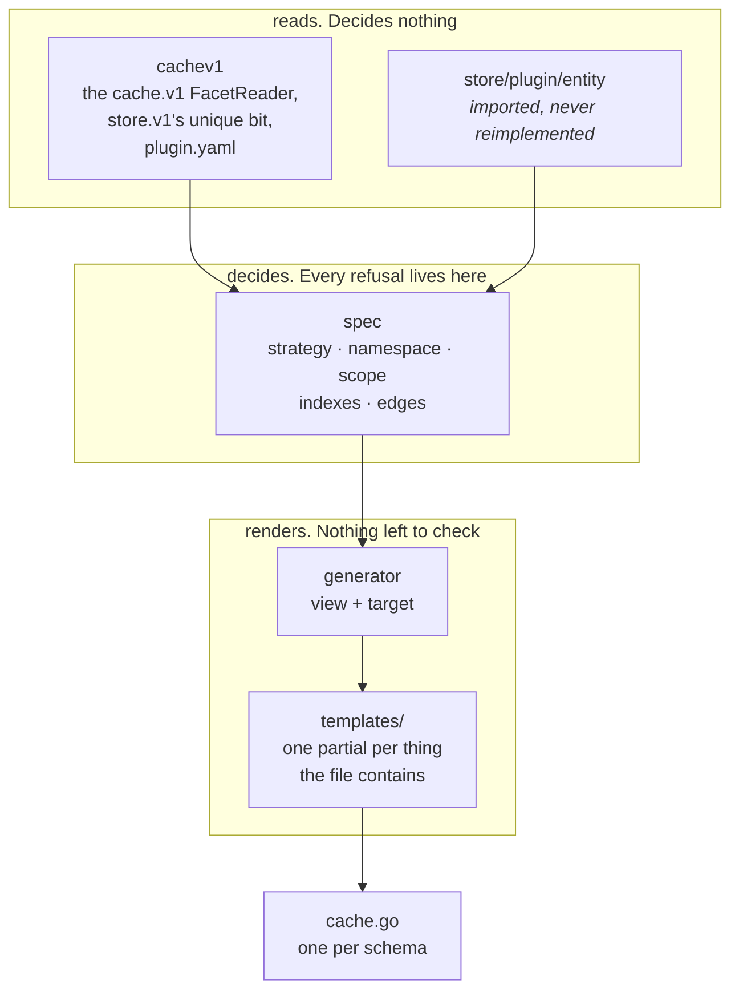

<h1 align="center">protoc-gen-cache</h1>

<p align="center">
  <strong>Your store, cached, without your callers knowing.</strong>
  protoc-gen-cache is a <code>protoc</code> plugin that turns
  <code>cache.v1</code> annotations on your AIP protobuf into typed read-through
  decorators over <a href="https://github.com/the-protobuf-project/store">protoc-gen-store</a>'s
  generated stores — and <strong>refuses to emit</strong> when the result would
  let one tenant read another's rows.
</p>

<p align="center">
  <a href="https://github.com/the-protobuf-project/cache/actions/workflows/test.yaml"></a>
  <a href="https://github.com/the-protobuf-project/cache/actions/workflows/lint.yaml"></a>
  <a href="https://pkg.go.dev/github.com/the-protobuf-project/cache"></a>
  
  
</p>

> [!CAUTION]
> Early development. The generated output may change between versions. Pin a
> release tag in CI and review the diff before shipping a regenerated decorator —
> a changed namespace orphans a live cache on deploy.

## Contents

- [Why](#why)
- [The problem it actually solves](#the-problem-it-actually-solves)
- [Install](#install)
- [Quick start](#quick-start)
- [Strategies](#strategies)
- [Annotations](#annotations)
- [Scoping and the namespace](#scoping-and-the-namespace)
- [What a write reaches](#what-a-write-reaches)
- [Two paths, and they do not stack](#two-paths-and-they-do-not-stack)
- [Architecture](#architecture)
- [What it does not do](#what-it-does-not-do)
- [Development](#development)
- [License](#license)

## Why

**A cache in front of a database is four hard problems wearing a trench coat**,
and the hand-written version gets three of them wrong. It stampedes: a thousand
concurrent misses on a hot key become a thousand identical loads at the worst
possible moment. It caches the value but not its absence, so a request for
something that does not exist reloads forever. It blocks every reader the instant
a hot key expires. And it invalidates by hand, which means the invalidation is
correct until the day someone adds a write path and forgets.

The runtime — [runtime-go/cache](https://github.com/the-protobuf-project/runtime-go)
— already solves all four. What it cannot know is *your schema*: which resources
are worth caching, what separates one tenant's entries from another's, which
column you look things up by, and which writes make which other entries stale.
That is in your protos already, as AIP annotations, and this plugin is the part
that reads it.

The output is a decorator implementing the same `<Model>StoreIface`
protoc-gen-store emitted. A caller narrows to the interface and stops knowing
which one it holds.



Neither plugin knows the other ran. They agree on every database, schema, table
and column name because they read the neutral vocabulary through **the same
imported reader** — not a shared convention, a shared function. That is the claim
`TestIRAgreement` holds them to, against the real protoc-gen-store rather than a
stand-in.

## The problem it actually solves

Generating cache wiring is the easy half. The hard half is that **a cache answers
before the store is consulted, so on a hit the store's scoping never runs.**

Every row-level guard a store applies — a `WHERE` on a parent id, a policy on a
connection, a tenant column — lives inside the loader, and the loader runs only
on a miss. Put a cache in front of a nested resource without binding the parent
into the key, and two tenants share a keyspace:

```proto
message Document {
  option (google.api.resource) = {
    type: "tenancy.v1/Document"
    pattern: "users/{user}/documents/{document}"   // ← nested under {user}
  };
  option (cache.v1.cache) = {enabled: true};

  string user_id = 2 [(google.api.field_behavior) = REQUIRED];  // ← binds nothing
}
```

The first hit serves whichever tenant was cached first. Nothing downstream
recovers from it: not a review, not a test that happens to use one tenant, not a
runtime check the runtime has no way to make. So this is the one thing the
generator refuses to emit:

```console
$ buf generate
cache: tenancy.v1.Document: the resource pattern "users/{user}/documents/{document}"
       nests this resource under {user}, but no field binds that segment into the
       cache namespace.

       A cache answers before the store is consulted, so on a hit the store's
       row-level scoping never runs. With {user} unbound, every parent's entries
       share one keyspace and the first hit serves whichever was cached first —
       one tenant reading another's rows. This is the one thing this generator
       refuses to emit.

       Bind it on the field that carries the parent's id:

           string user_id = N [(cache.v1.cache_scope) = {}];
```

A warning would not do. It would be printed into a build log next to a hundred
others, and the output would still be generated, and it would still compile, and
it would still be wrong.

## Install

```sh
brew install the-protobuf-project/tap/protoc-gen-cache
# or
go install github.com/the-protobuf-project/cache/plugin/cmd/protoc-gen-cache@latest
```

The `cache.v1` vocabulary is published separately, to the BSR — someone
annotating protos needs the module, not the plugin:

```yaml
# buf.yaml
deps:
  - buf.build/the-protobuf-project/cache
  - buf.build/the-protobuf-project/entity
```

## Quick start

### Annotate

```proto
message Book {
  option (google.api.resource) = {
    type: "bookstore.v1/Book"
    pattern: "authors/{author}/books/{book}"
  };
  option (cache.v1.cache) = {
    enabled: true
    strategy: STRATEGY_INDEXED
    ttl: {seconds: 120}
  };

  string author_id = 3 [(cache.v1.cache_scope) = {}];   // binds {author}
  string isbn = 4 [(cache.v1.cache_index) = {}];        // findable by ISBN
}
```

### Generate

```yaml
# buf.gen.yaml
plugins:
  - local: protoc-gen-store
    out: generated/gorm
    opt: [target=gorm, stores=true, go_module=github.com/me/gen/gorm]

  - local: protoc-gen-cache
    out: generated/cache
    opt: [store_module=github.com/me/gen/gorm]
```

`stores=true` is required: it is what makes protoc-gen-store emit the
`<Model>StoreIface` this plugin decorates. `store_module` is the import path of
that output — the only thing connecting the two runs, and a path rather than a
dependency.

### Wire

```go
scope := bookstorev1cache.BookScope{AuthorID: id}
db, err := bookstorev1cache.OpenBookCache(ctx, provider, scope)
books, err := bookstorev1cache.NewCachedBookStore(ctx, inner, db, scope,
    bookstorev1cache.BookEdges{Author: authors})
```

`books` is a `BookStoreIface` — the same interface `inner` satisfies.

### Run it

```sh
docker run --rm -p 6379:6379 redis:7      # or: redis-server --port 6379
cd examples && go run ./cmd/bookstore
```

The example is one straight run of numbered steps, deliberately unfactored, so
the lifecycle reads top to bottom:

```
1. open redis client
2. build provider
3. open author cache database
4. seed the inner author store
5. build cached author store
6. bind the book scope
7. open book cache database
8. build cached book store (asserts core.Sets)

9.  read author  -> Ursula K. Le Guin   (miss, loaded from store, store loads: 1)
10. read author  -> Ursula K. Le Guin   (hit, store loads: 1)
11. write book   -> created, edge fired at bookstore.v1.Author
12. read author  -> reloaded (store loads: 2 — the edge worked)
13. by isbn      -> 1 book(s) filed under 9780441013593
14. declared invalidation edges:
      bookstore.v1.Book -> bookstore.v1.Author (via author_id)
15. entries left in redis, by namespace: ...

teardown (reverse order):
   close book cache database
   close author cache database
   close redis client
```

The store-load counter is doing the work: unchanged between 9 and 10 is the cache
hit, moving at 12 is the declared edge having actually dropped the Author entry.
Steps 10 and 12 *fail* rather than print if either stops being true — a demo that
can only ever print success is not showing you anything.

**Nothing is deleted on the way out.** The teardown closes; it does not drop. The
argument about who owns which part of a key is only convincing if you can go and
look:

```console
$ redis-cli --scan --pattern 'bookstore:*'
bookstore:bookstore.v1.author:cache:aside:entry:author-ursula
bookstore:bookstore.v1.book.author.author-ursula:cache:aside:entry:book-lhd
bookstore:bookstore.v1.book.author.author-ursula:cache:idx:by:isbn:9780441013593
bookstore:bookstore.v1.book.author.author-ursula:cache:idx:entry:book-lhd
bookstore:bookstore.v1.book.author.author-ursula:cache:idx:fields:book-lhd
bookstore:bookstore.v1.book.author.author-ursula:cache:idx:index
```

Take one apart:

```
bookstore : bookstore.v1.book.author.author-ursula : cache:idx:by:isbn:9780441013593
─────────   ────────────────────────────────────────   ──────────────────────────────
Config.Prefix          this plugin                     runtime-go/cache/core
your deployment        the namespace                   the keyspace
```

Three segments, three owners, no overlap. The middle one is the whole of what this
plugin emits about keys — `author.author-ursula` is the tenancy boundary, and a
decorator built for another author cannot reach these entries.

## Strategies

Four, because runtime-go implements four. A vocabulary that could express a fifth
would describe output nothing will honor.

| Strategy | Reads by | Enumerates | Secondary index | Needs |
|---|---|---|---|---|
| `ASIDE` *(default)* | id, read-through | no | no | — |
| `INDEXED` | id + any indexed field | yes | yes | `core.Sets` |
| `DOCUMENT` | id | yes | no | `core.Sets` |
| `VOLATILE` | key | no | no | — |

A `stale` window on any of them additionally needs `core.Leases`.

Nothing in `cache.v1` names a backend. Redis, Dragonfly and memcached differ in
what they can do, and the runtime already models that as capabilities a driver
either has or does not:



Redis and Dragonfly trace the same shape because they *are* the same driver —
both speak RESP and share `runtime-go/cache/resp`. Swapping one for the other is
two lines (`dragonfly.NewClient`, `dragonfly.New`) and nothing else.

memcached is the shape that matters. It has `Bulk` and nothing else: no
server-side sets, so no index and no enumeration, and a protocol that stores an
expiry but will never say what is left of it, so no stale window. An `INDEXED`
resource on memcached would compile, construct, and then fail every lookup it
exists to serve — on a code path a developer running Redis locally never reaches.

So the generated constructor **probes and refuses at startup**, naming the
resource, the strategy and the missing capability:

```console
cache: bookstore.v1.Book is configured as INDEXED, which requires core.Sets, and
the memcache backend behind this cache database does not implement it:
cache: unsupported

A backend with no server-side sets cannot maintain a secondary index or enumerate
entries. Either move this resource to STRATEGY_ASIDE or STRATEGY_VOLATILE, or
wire it to a backend with sets (redis, dragonfly).
```

The same requirement is also declared in `plugin.yaml`, under
`requires_capability`, so whatever eventually schedules a multi-plugin run can
refuse a plan before anything is written. The two are not redundant: that one
fails early, and this one is the only check that sees the driver a process
actually wired up.

## Annotations

**Message** — `(cache.v1.cache)`

| Field | Meaning |
|---|---|
| `enabled` | Cache this resource. Explicit, so a configuration can be switched off without being deleted. |
| `strategy` | `ASIDE` (default), `INDEXED`, `DOCUMENT`, `VOLATILE`. |
| `ttl` | How long an entry stays fresh. |
| `stale` | How long past `ttl` an entry may be served while it refreshes. Needs `core.Leases`. |
| `negative_ttl` | How long an absence is remembered. |
| `namespace` | Override the derived namespace. Must bind every parent segment. |

**File** — `(cache.v1.cache_defaults)`: `strategy`, `ttl`, `stale`,
`negative_ttl`. A per-message value always wins.

**Field** — `(cache.v1.cache_index)` files a secondary index; string columns only,
because the runtime's index is keyed by string end to end and inventing a
rendering for an int would mean anything else reading that index has to guess the
same one. `(cache.v1.cache_scope)` binds a field into the namespace.

There is deliberately no `prefix`. The runtime owns that, as
`cache.Config.Prefix`, because a prefix separates one *deployment's* keys from
another's — and an annotation that travels with the proto cannot express that.
`cache.v1` shipped one once; the first program to set both simply concatenated
them. See finding 6.

## Scoping and the namespace

Every parent segment of a resource pattern must be bound. How a segment finds its
binding, in order:



Binding is deliberately **explicit** — a field must carry
`(cache.v1.cache_scope)` to be a candidate at all. protokit materializes a parent
FK column for every nested resource whether or not anyone thought about tenancy,
so an inference that fired on a column's shape alone would make the refusal
unreachable.

Two more guards run at construction, because they depend on facts only the
deployment knows:

- **Namespace.** The `*cache.DB` you pass must have been opened under the
  namespace this decorator's keys are derived for. Use the generated
  `Open<Model>Cache`, or get an error naming the resource.
- **Capabilities.** The probe above.

And one that no namespace check would catch: **an empty scope value is refused**.
`BookScope{}` produces a *self-consistent* namespace, so the decorator and the
database agree and the namespace assertion passes — while every parent collapses
into one keyspace, which is the exact failure the scope exists to prevent.

## What a write reaches

A write to `Book` invalidates the `Author` entries that preload it. Those edges
are **declared in the output**, not walked at runtime:

```go
var InvalidationEdges = []Edge{
    {From: "bookstore.v1.Book", To: "bookstore.v1.Author", Via: "author_id",
     Reason: "Book.author_id references Author, so writing a Book changes what that Author preloads"},
}
```

The decorator fires them through named fields on `BookEdges` — a nil field is a
decision not to invalidate, made in the open. The set is emitted alongside so the
blast radius of a write is legible, and so a CDC consumer can read it later
without regenerating anything.

Here is that blast radius, for one `Create` of one `Book` — an `INDEXED` resource
with one index and one edge:



Widths are round trips. Two of them are worth knowing about before you reach for
`INDEXED`, and neither is this generator's to fix:

- **The `SELECT`.** `Aside.Refresh` runs the loader, and the loader is
  `GetByID` — so every `Create` and `Update` re-reads from the database the row it
  was just handed. `cache.Aside` has `GetOrLoad`, `Refresh` and `Invalidate` and
  no `Put`, so there is no way to hand it the value in hand. Finding 7.
- **Two entries for one row.** `GetByID` reads the Aside entry while `ByISBN`
  reads the Indexed one, and they live under different keys. Finding 8.

**A failed invalidation does not fail your write.** The store write commits before
any of this runs, so returning the error would tell a caller their write failed
when it did not — and the ordinary response to that is a retry, which makes a
second row. By default the error does not travel; staleness bounded by the TTL is
the better trade. Both halves are opt-in:

```go
WithWriteErrors(func(ctx context.Context, resource, op string, err error) { ... })
WithStrictWrites()   // the other trade: fail the call rather than serve stale
```

Mind the resource with no `ttl`: its entries persist until something invalidates
them, so a dropped invalidation there is not stale-for-a-minute, it is stale until
the next successful write.

## Two paths, and they do not stack

|  | **Generated decorator** (this plugin) | **`cached.Wrap`** (runtime-go) |
|---|---|---|
| Level | Typed, per resource | Untyped, per driver |
| Wraps | `BookStoreIface` | `store.Driver` |
| Payload | Your model, JSON-encoded | Raw bytes |
| Knows about | Namespaces, scopes, index fields, invalidation edges | Keys and values |
| Setup | Generated from annotations | One call |

```go
// untyped: decorates any store.Driver at the byte level
db = cached.Wrap(db, cached.FromAside(cdb, cache.TTL(time.Minute)))
```

**They are alternatives, not layers.** Stacking them puts two caches on one read:
the decorator hits, or misses and calls a store whose driver caches the same row
again under a different key — and an invalidation through one leaves the other
serving what it just invalidated.

## Architecture

Built on [protokit](https://github.com/the-protobuf-project/protokit), the same IR
engine behind [store](https://github.com/the-protobuf-project/store), and laid out
the same way.

```
cache/
├─ protobuf/cache/v1/        the vocabulary — the only thing published
│    annotations.proto         the four extensions (52000–52003)
│    cache.proto               the option messages and the Strategy enum
├─ plugin/
│    cmd/protoc-gen-cache/     the binary
│    pb/cachepbv1/             generated stubs
│    cachev1/                  reads annotations. Decides nothing
│    spec/                     decides everything. Every refusal lives here
│    generator/                renders. Nothing is left to check by then
│      templates/              one partial per thing the generated file contains
├─ examples/                 its own module
│    proto/                    the schemas
│    generated/                both plugins' output
│    cmd/bookstore/            the runnable Redis program
│    decorator/                the tests over the generated decorator
│    fakecache/                a core.Driver whose capabilities are per-instance
│    fakestore/                the store protoc-gen-store would have generated
├─ docs/boundary-findings.md every place the plugin boundary was thinner than it looked
└─ scripts/aip.sh            the AIP lint, run in CI and runnable by hand
```

`protobuf/cache/v1` is the vocabulary, published as a BSR module and the only
thing published. Everything under `plugin/` runs at generation time:



The dependency runs one way and the three packages are split by **how they fail**.
`cachev1` can only fail on a malformed descriptor. `spec` is where a schema is
rejected, so its errors have the proto in hand and no template context to muddy
them. `generator` cannot fail on a schema at all, which is what keeps the
templates free of validation.

**The most load-bearing thing in the tree is an omission.** `cachev1` implements
`schema.FacetReader` and deliberately **not** `schema.StructureReader`. Structure
is how a vocabulary tells protokit what things are *called*; `cache.v1` has
opinions about none of it. So agreement with protoc-gen-store is not a property
anyone maintains — this plugin has no mechanism by which it could move a name.
`TestReaderIsNotAStructureReader` pins the omission, because the golden and
agreement tests would only catch a violation on names some case happens to
exercise.

## What it does not do

**It does not generate key templates.** `runtime-go/cache/core/keyspace.go` owns
key layout — `{head}cache:aside:entry:{id}` and the rest. This plugin generates
the *namespace* the keyspace is built under and never a key inside it. Two
keyspaces that have to agree is one keyspace too many, and a golden test asserts
the generated file imports no `core`.

**It does not implement** singleflight, negative caching, TTL enforcement,
alias/reverse index maintenance, or stale-while-revalidate. All of that is in
`core`, and better than a generator would emit.

**It does not cache lists.** The decorator embeds the store interface, so `List`,
`Count` and anything protoc-gen-store adds later pass straight through, uncached.
A list result keyed by its filter is a different cache with different
invalidation, and silently serving one from here is the kind of correctness bug a
cache is not supposed to introduce.

**It does not translate your store's errors.** Negative caching engages only when
the loader returns something wrapping `cache.ErrNotFound`, and the generated store
returns its driver's error unchanged. Translating `gorm.ErrRecordNotFound` here
would mean importing gorm into generated cache code, so it is a constructor
option — `WithNotFound` — instead.

**It does not name a backend.** Redis, Dragonfly and memcached differ in
capabilities, which the runtime already models; a proto is the wrong place to
choose a deployment's infrastructure.

## Development

Everything resolves from the module proxy — no workspace required, as of
`store v1.5.1` being tagged under its own module path.

```sh
buf lint && buf format --diff --exit-code && buf build
go build ./... && go vet ./... && go test ./...
(cd examples && go build ./... && go vet ./... && go test ./...)
./scripts/aip.sh                       # AIP lint, no config and no disabled rule

# end to end: both plugins over one set of protos, then compile the result
go install github.com/the-protobuf-project/store/plugin/cmd/protoc-gen-store@v1.5.1
go install ./plugin/cmd/protoc-gen-cache
buf generate --template buf.gen.example.yaml
```

The committed `go.work` groups the two modules for an editor and a
repository-wide test run. It carries no `replace` directives and nothing depends
on it; `GOWORK=off` passes in both modules independently, and CI keeps that true.

Two module-graph facts will bite you if you touch `go.mod`, both in finding 5 of
[docs/boundary-findings.md](docs/boundary-findings.md):

- **Never require `github.com/the-protobuf-project/store/plugin/entity`.** It was
  a nested module, it was deleted, and its old commits are still resolvable — so
  requiring it puts two modules in the graph that both contain that package and
  every build fails with `ambiguous import`. Require `store`; the package comes
  from the root module now.
- **`examples/go.mod` needs its three `replace` lines.** `runtime-go` is untagged,
  and `runtime-go/cache` replaces its siblings in its own go.mod, which Go ignores
  in a dependency. A `require` cannot substitute: a pseudo-version of `v0.0.0`
  sorts *below* `v0.0.0`, so MVS picks the version that does not exist.

### CI

| Job | Covers |
|---|---|
| `Test (Go)` | the generator: goldens, IR agreement, refusals, manifest, boundary |
| `Test (examples)` | the *generated* code — a separate module, so the root's `go test ./...` never reaches it |
| `Modules build standalone` | `GOWORK=off` in both modules, and a guard on the deleted `store/plugin/entity` |
| `Integration (Redis)` | the decorator against a real backend, asserting on the keyspace |
| `Examples reproduce` | the committed output still matches what both plugins emit |
| `Build (os/arch)` | six platforms |
| `Lint (Go / Proto / AIP)` | gofmt, vet, golangci-lint; buf build/lint/format and stub freshness; api-linter |

**`Integration (Redis)` is the one that earns its keep.** Findings 6, 8 and 9 in
[docs/boundary-findings.md](docs/boundary-findings.md) — a duplicated key prefix,
an `INDEXED` resource stored twice, index sets that never expire — passed every
unit test here and were caught only by running the generated code against Redis
and reading the keyspace back. A generator's tests prove its output is consistent
with itself; nothing but a real backend proves it is right.

Tagging `v*` runs GoReleaser and `buf push`. Dependabot pull requests merge
themselves once every check passes — see
[.github/AUTOMATION.md](.github/AUTOMATION.md) for how that gate works, why it
does not use GitHub's native auto-merge, and what still has to be added before the
first release.

Both the vocabulary and the examples pass
[api-linter](https://github.com/googleapis/api-linter) with one suppression, in
the proto and with its reasoning beside it: AIP-123 wants a `google.api.resource`
on any message carrying a `name` field, and `IndexOptions` is an annotation
payload rather than a resource.

## License

Not yet chosen — see [.github/AUTOMATION.md](.github/AUTOMATION.md). A `LICENSE`
has to land before the first release.

[protoc-gen-store]: https://github.com/the-protobuf-project/store
[protokit]: https://github.com/the-protobuf-project/protokit
